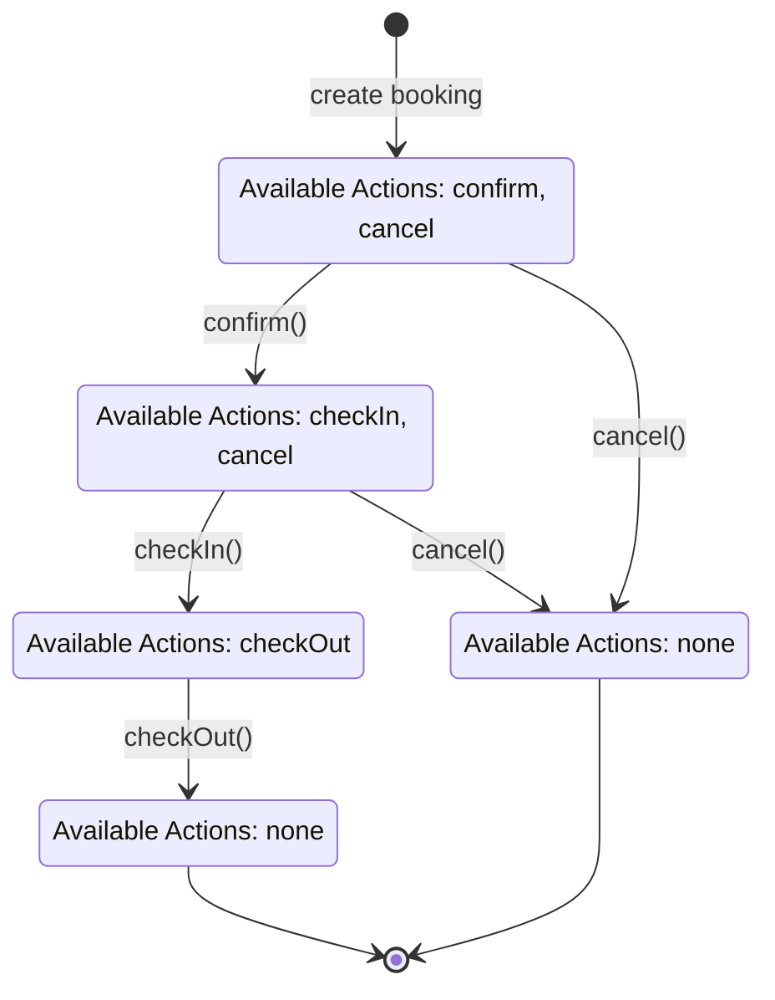
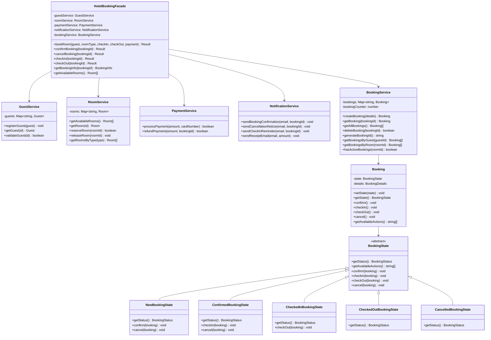
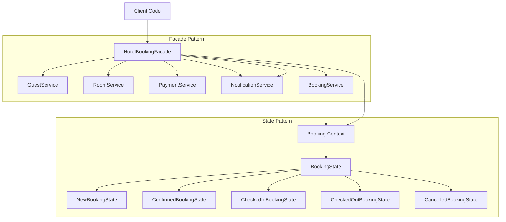

# UML Diagrams for Hotel Booking System

## State Pattern - Booking State Diagram

## Facade Pattern - Class Diagram

## System Architecture Overview

## Pattern Benefits

### Facade Pattern Benefits:
- **Simplification**: Complex booking process simplified to single method calls
- **Encapsulation**: Internal service complexity hidden from clients
- **Loose Coupling**: Client depends only on facade, not individual services
- **Centralized Control**: Single point for booking operations

### State Pattern Benefits:
- **State Management**: Clear state transitions and available actions
- **Error Prevention**: Invalid operations automatically blocked
- **Maintainability**: Easy to add new states or modify transitions
- **Code Organization**: State-specific behavior encapsulated in state classes
